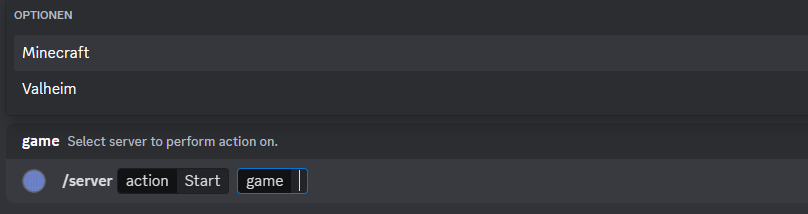

# Server Management Bot

Server Management Bot is a Discord Bot that can be hosted on a remote server which hosts many different gaming servers.
It allows to start, stop and check for the server status.

Additionally, resources can be monitored and plotted.

# Setup

1. Clone the repository
2. Copy `config_template.json` as `config.json`
3. Fill all relevant information in `config.json`
4. Setup the virtual environment `python3 -m venv venv`
5. Activate virtual environment and `source venv/bin/activate`
6. Install requirements `pip install -r requirements.txt`
7. Run `python main.py`

# Features

## Server Management
One of many different actions can be chosen.

Then, the server can be chosen for which the action shall be applied on.

## Resource Monitoring
Resource usage can be monitored for the last 180 seconds.

